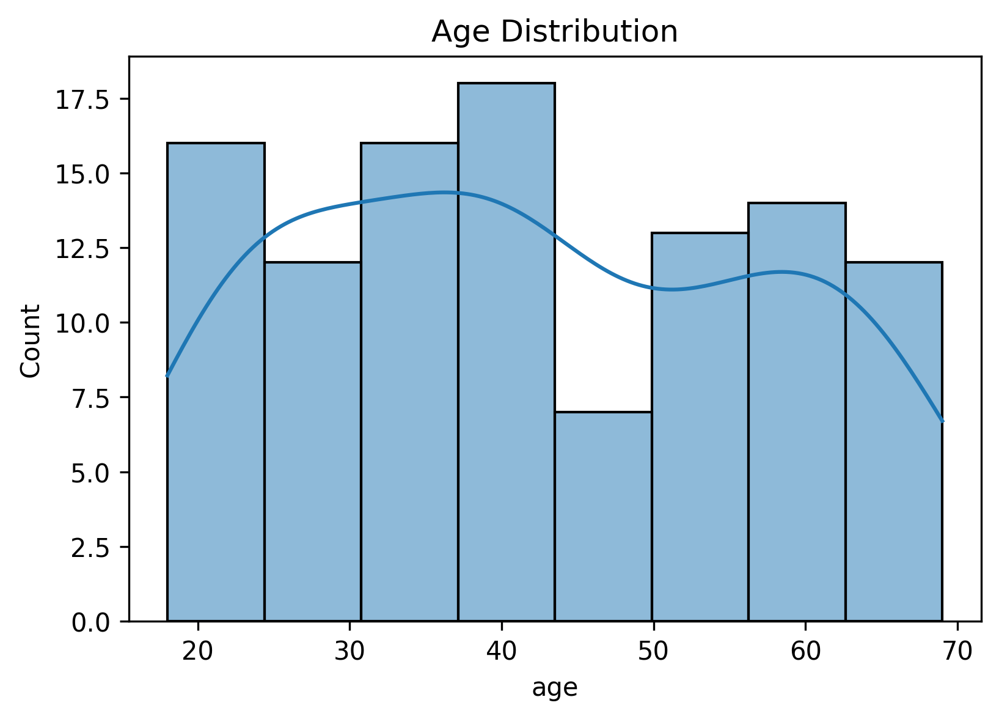
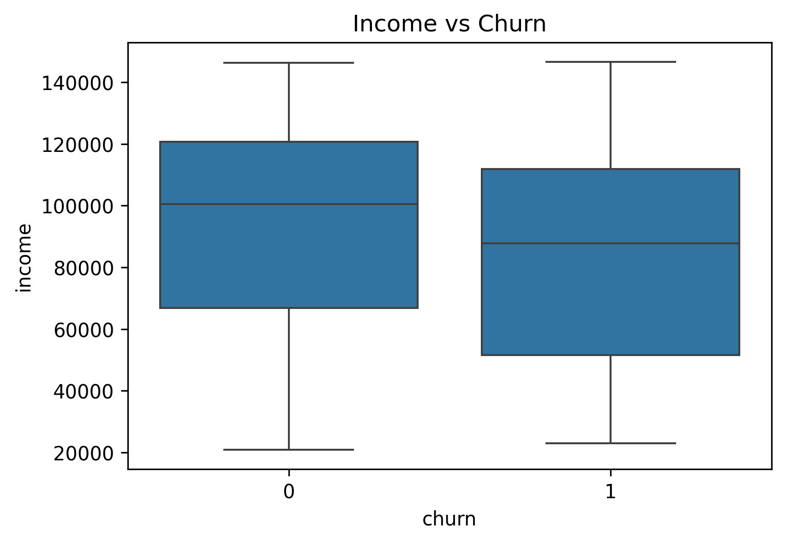
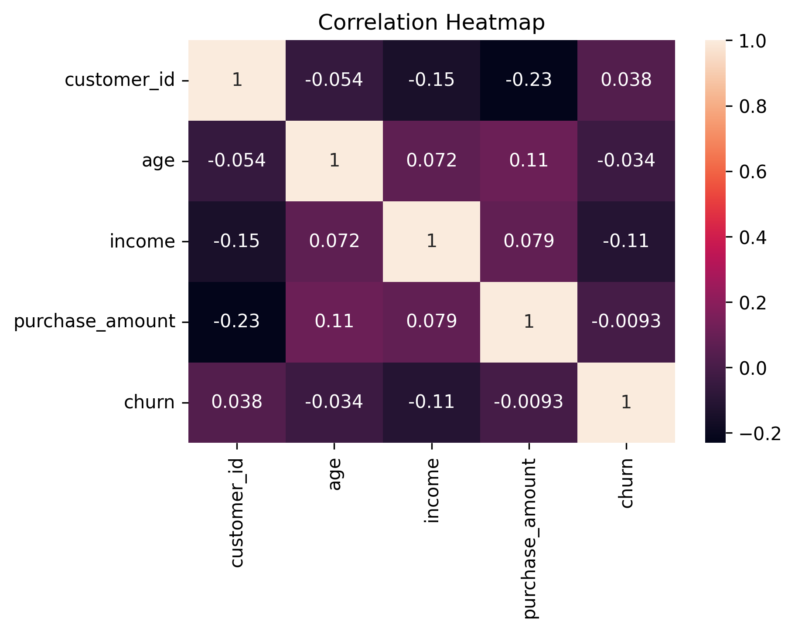

# 📊 Data Profiler Project  
### 🚀 Data Preprocessing & Feature Engineering

---

## 📌 Overview  
This project focuses on performing **data preprocessing, cleaning, and exploratory data analysis (EDA)** on a real-world-like dataset.  

The goal is to transform raw data into a **machine learning-ready dataset** and extract meaningful insights.

---

## 🎯 Problem Statement  
As a **Junior Data Analyst**, the task is to analyze customer data collected from multiple sources and prepare it for predicting **customer churn**.

---

## 🧠 Project Workflow  

| Step | Description |
|------|------------|
| 📥 Data Collection | Load data from CSV, JSON, API |
| 🧹 Data Cleaning | Handle missing values, duplicates, outliers |
| 📊 EDA | Analyze patterns using graphs |
| 📑 Profiling | Generate automated report |
| 💾 Save Data | Export cleaned dataset |

---

## 📁 Dataset Information  

| File | Description |
|------|------------|
| [customers.csv](Data/Raw/customers.csv) | Main customer dataset |
| [transactions.json](Data/Raw/transactions.json) | Transaction-level data |
| [api_data.json](Data/Raw/api.json) | Simulated API data |
| [cleaned_data.csv](Data/Processed/cleaned_data.csv) | Final processed dataset |


---

## ⚙️ Key Steps Performed  

- Handled missing values using mean imputation  
- Removed duplicate records  
- Detected and removed outliers  
- Performed univariate, bivariate & multivariate analysis  
- Generated automated profiling report  

---

## 📊 Key Insights  

- Customers with **higher income tend to churn less**  
- Most customers fall in the **mid-age group (25–50)**  
- Weak correlations observed between features (from heatmap)  

---

## 📈 Important Visualizations  

### 🔹 Age Distribution


### 🔹 Income vs Churn


### 🔹 Correlation Heatmap


---

## 📑 Data Profiling Report  

👉 Click to view full report:  
[Open Profiling Report](Reports/profiling_report.html)

---

## 🛠️ Tools & Technologies  

- 🐍 Python  
- 📊 Pandas, NumPy  
- 📉 Matplotlib, Seaborn  
- 📑 ydata-profiling  
- ☁️ Google Colab  

---

## 📂 Project Structure  

```
data-profiler-project/
│
├── data/
│ ├── raw/
│   ├── api_data.json
│   ├── customers.csv
│   └── transactions.json
│ └── processed/
│   └── cleaned_data.csv
│
├── notebooks/
│ └── data_profiler.ipynb
│
├── reports/
│ ├── figures/
│ └── profiling_report.html
│
├── Data_Preprocessing_Theory.pdf
├── README.md
└── requirements.txt
```


---

## ▶️ How to Run  

1. Clone the repository  
2. Install dependencies  
3. Open notebook:


---

## 📄 Documentation  

👉 Theory document:  
[View PDF](Data_Preprocessing_Theory.pdf)


---

## 🌍 Real-World Importance  

In real-world data science, **data preprocessing takes most of the effort**.  

If data is not clean:
- Models give incorrect predictions  
- Insights become unreliable  

This project demonstrates how raw data can be transformed into meaningful insights.

---

## 👤 Author  

***Paree Ghanshyambhai Sojitra***

> *✨"Transforming raw data into meaningful insights."*

### 🔗 GitHub: https://github.com/pareesojitra0803
---
